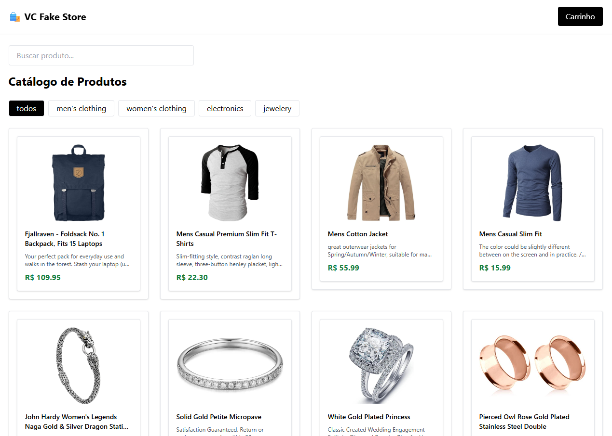
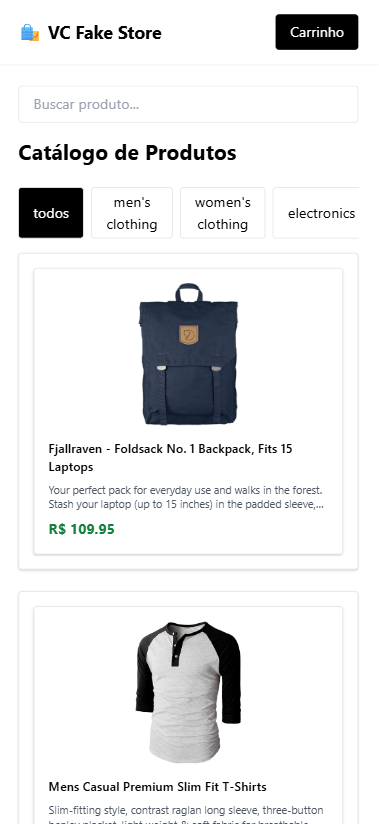

# 🛍️ SPA Catálogo de Produtos com React + Tailwind

Este é um projeto pessoal desenvolvido com o objetivo de praticar e demonstrar habilidades em desenvolvimento Front-End com React, utilizando boas práticas de código, consumo de API REST, gerenciamento de estado com Context API, responsividade e estilização moderna com Tailwind CSS.

---

## 🔗 Deploy

👉 [Acesse o projeto online](https://spa-catalogo-produtos.vercel.app/)

---

## 🎯 Funcionalidades

- ✅ Listagem de produtos reais da [Fake Store API](https://fakestoreapi.com/)
- ✅ Filtro por categoria e campo de busca por nome
- ✅ Página de detalhes do produto
- ✅ Carrinho de compras com Context API + persistência no localStorage
- ✅ Página de checkout com resumo e finalização do pedido
- ✅ Toasts de feedback (ex: produto adicionado)
- ✅ Layout responsivo e experiência fluida
- ✅ Footer fixo e estrutura adaptável a projetos reais
- ✅ Preparado para testes com React Testing Library

---

## 🧪 Tecnologias utilizadas

- [React](https://reactjs.org/)
- [TypeScript](https://www.typescriptlang.org/)
- [Vite](https://vitejs.dev/)
- [Tailwind CSS](https://tailwindcss.com/)
- [Axios](https://axios-http.com/)
- [React Router DOM](https://reactrouter.com/)
- [React Hot Toast](https://react-hot-toast.com/)
- [Framer Motion](https://www.framer.com/motion/) (animações)
- [React Testing Library](https://testing-library.com/) + [Vitest](https://vitest.dev/)

---

## 📸 Preview




---

## 🚀 Como rodar o projeto localmente

```bash
git clone https://github.com/vinicrevellari/spa-catalogo-produtos.git
cd seu-repo
npm install
npm run dev
```

---

## 📂 Estrutura do projeto

```
src/
├── components/        # Componentes reutilizáveis (Header, Footer, ProductCard etc)
├── contexts/          # Contexto global do carrinho
├── pages/             # Páginas: Home, Carrinho, Produto, Checkout
├── services/          # Configuração do Axios e API
├── types/             # Tipagens TypeScript
├── App.tsx            # Definição de rotas
└── main.tsx           # Renderização principal
```

---

## 👨‍💻 Autor

Desenvolvido por [**Vinícius Crevellari**](https://www.linkedin.com/in/vinicius-crevellari/)  
Frontend Developer

---

## 📌 Observações

> Este projeto é de cunho didático e faz parte do meu portfólio de desenvolvedor.  
> Nenhuma compra real é realizada — os dados são simulados via Fake Store API.

---

## 💼 Licença

Este projeto está sob a licença MIT.  
Sinta-se à vontade para estudar, adaptar ou se inspirar para seus próprios projetos.
